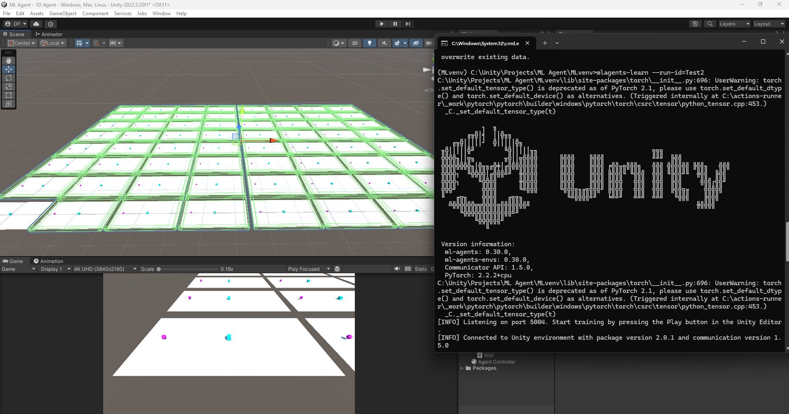
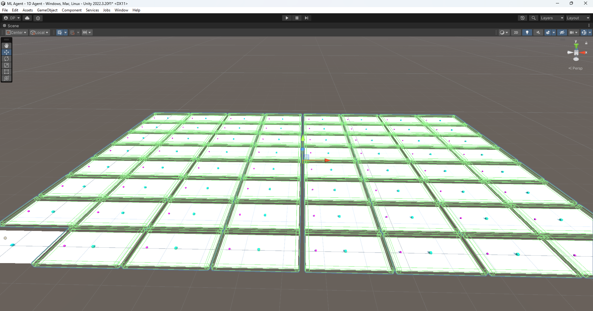
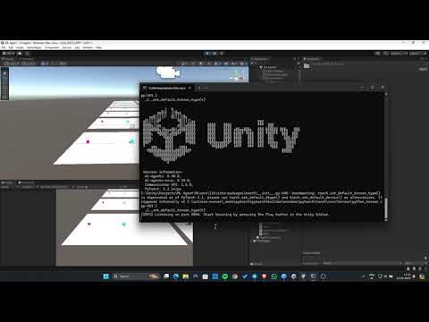

<p align="center">
  
</p>

<h1 align="center">Unity ML-Agents Food Collector</h1>

<p align="center">
  A Unity reinforcement and imitation-learning sandbox where agents navigate an arena, activate a food spawner, and collect the reward.
</p>

<p align="center">
  
  
  
  
</p>

## Overview

Unity ML-Agents Food Collector is a learning project for experimenting with agent observations, actions, rewards, PPO, and demonstration-assisted training. It contains a one-dimensional target-reaching exercise and a two-dimensional food-collection environment built from repeated training arenas.

The repository includes a recorded demonstration, PPO and imitation-learning configuration files, and an ONNX policy asset. See the project in motion in the [gameplay video](https://www.youtube.com/watch?v=i1orPLHQBbU) or visit the [portfolio page](https://devp2349.wixsite.com/dev-patel-portfoli/ml-agent-1) for the original showcase.

## Preview

<table>
  <tr>
    <td width="50%"></td>
    <td width="50%"><a href="https://www.youtube.com/watch?v=i1orPLHQBbU"></a></td>
  </tr>
  <tr>
    <td align="center"><sub>Repeated arenas for parallel experience collection</sub></td>
    <td align="center"><sub>Watch the gameplay and training demo</sub></td>
  </tr>
</table>

## Highlights

- **Two learning scenarios:** a 1D continuous-action target task and a 2D discrete-action food-collection task.
- **Parallel environments:** the 2D scene repeats the reusable `Environment` prefab across a large training grid.
- **Demonstration-assisted PPO:** `config/Imitation.yaml` combines extrinsic rewards with GAIL and behavioral cloning.
- **Manual heuristic controls:** drive the 2D agent from the keyboard and activate the nearby food button.
- **Training artifacts included:** use `Demos/FoodAgentDemo.demo` for imitation learning and inspect the bundled `Assets/Agent Controller.onnx` policy.

## How It Works

The 2D agent starts at a randomized position while the food button moves to a new point in the arena. Its discrete actions control horizontal movement, vertical movement, and interaction.

1. Navigate toward the green button.
2. Activate it to spawn food and receive a positive reward.
3. Reach the food to finish the episode successfully.
4. Avoid the walls, which apply a negative reward and end the episode.

The 1D scene is a smaller exercise: an agent moves left or right toward a target that changes sides at the start of each episode.

## Getting Started

### Requirements

- [Git](https://git-scm.com/)
- [Unity Hub](https://unity.com/download)
- Unity Editor **2022.3.20f1**
- A Release 19-compatible Python environment for training only

### Run the project

```bash
git clone https://github.com/Dev0910/Unity-ML-Agents-Food-Collector.git
cd Unity-ML-Agents-Food-Collector
```

1. Add the repository folder as a project in Unity Hub.
2. Open it with Unity `2022.3.20f1` and allow the Package Manager to restore dependencies.
3. Open `Assets/Scenes/2D Agent.unity`.
4. Press Play and focus the Game view to use the heuristic controls.

> The repository does not contain a packaged build or scenes configured in Unity Build Settings. Run the environments from the Editor.

## Controls

| Input | Action |
| --- | --- |
| `W` / `Up Arrow` | Move forward along the Z axis |
| `S` / `Down Arrow` | Move backward along the Z axis |
| `A` / `Left Arrow` | Move left along the X axis |
| `D` / `Right Arrow` | Move right along the X axis |
| `Space` | Activate the food button when nearby |

The 1D scene uses only the horizontal axis: `A` / `D` or the left / right arrow keys.

## Training

The Unity project uses `com.unity.ml-agents` `2.0.1`. Its matching Release 19 training package is `mlagents==0.28.0`; follow the official [Release 19 installation guide](https://github.com/Unity-Technologies/ml-agents/blob/release_19_docs/docs/Installation.md) for the supported Python environment and the Windows PyTorch prerequisite.

Create and activate an isolated Python environment, then install and verify the trainer:

```bash
python -m venv .venv
# Activate .venv for your shell before continuing
python -m pip install mlagents==0.28.0
mlagents-learn --help
```

Prepare the 2D environment in Unity:

1. Open `Assets/Scenes/2D Agent.unity`.
2. Open `Assets/Prefab/Environment.prefab` and select its `Agent` child.
3. In **Behavior Parameters**, change **Behavior Type** from **Heuristic Only** to **Default**.
4. Save the prefab, return to the scene, and leave the Editor out of Play mode.

From the repository root, start the imitation-learning run:

```bash
mlagents-learn config/Imitation.yaml --run-id=food-collector-imitation
```

When the trainer asks you to start the Unity environment, press Play in the Editor. Stop training with `Ctrl+C`; ML-Agents writes summaries, checkpoints, and the exported model below `results/food-collector-imitation/`. See the official [training guide](https://github.com/Unity-Technologies/ml-agents/blob/release_19_docs/docs/Training-ML-Agents.md) for resume, monitoring, and inference options.

> **Configuration note:** `config/Imitation.yaml` is the documented training path. `config/Basic.yaml` is an experimental draft whose current indentation does not match the Release 19 trainer schema; review and correct it before attempting to use it.

## Tech Stack

| Technology | Version or role |
| --- | --- |
| Unity | `2022.3.20f1` |
| Unity ML-Agents | `2.0.1` C# package |
| ML-Agents Trainer | `0.28.0` for the documented Release 19 workflow |
| C# | Agent observations, actions, rewards, spawning, and interaction |
| PPO, GAIL, behavioral cloning | Training methods configured in `config/Imitation.yaml` |
| ONNX / Barracuda | Saved policy asset and Unity inference runtime |

## Project Structure

```text
.
├── Assets/
│   ├── Agent Controller.onnx   # Included policy asset
│   ├── Prefab/                 # Reusable environment and food prefabs
│   ├── Scenes/                 # 1D and 2D learning environments
│   └── Scripts/                # Agent and environment behavior
├── config/
│   ├── Basic.yaml              # Experimental PPO configuration draft
│   └── Imitation.yaml          # PPO + GAIL + behavioral cloning
├── Demos/
│   └── FoodAgentDemo.demo      # Recorded expert demonstration
├── Packages/                   # Unity package manifest and lockfile
└── ProjectSettings/            # Unity 2022.3 project settings
```

## Project Status

This is a portfolio learning project rather than a packaged game. The Unity scenes, agent scripts, demonstration, training configuration, and model asset are present; downloadable builds, configured build scenes, releases, and automated project tests are not included.
